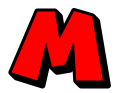
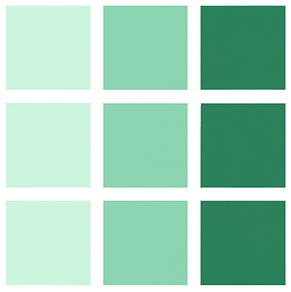

# Welcome to my Portfolio!

In this portfolio, I want to showcase selected projects.

## 🧩 About Me

My friends call me Desh and I'm interested in building custom applications because I am tired of spending countless hours trying to find the "perfect app", when I can just make them myself – all while making life just a little more exciting. 👾

**Main focus:** Web Development, Automation, Data Handling.

## 📂 Projects

###  MarioTodo

[🔗 Live App](https://todo-list-six-puce.vercel.app/) | [💻 Source Code](https://github.com/Deshenfektion/todo-list)

###  MyHeatmap

[🔗 Live App](https://heatmap-app-two.vercel.app/) | [💻 Source Code](https://github.com/Deshenfektion/heatmap-app)

## 🚀 Goals

- Building useful software while being creative
- Building strong fundamentals and not relying too much on abstractions (e.g. always the same languages or frameworks)
- Embracing passion for development, constantly learning more about it and having fun!

## 📫 Contact

Feel free to reach out via [LinkedIn](https://www.linkedin.com/in/deshenrao/) or [Email](mailto:deshen.r1502@gmail.com)
